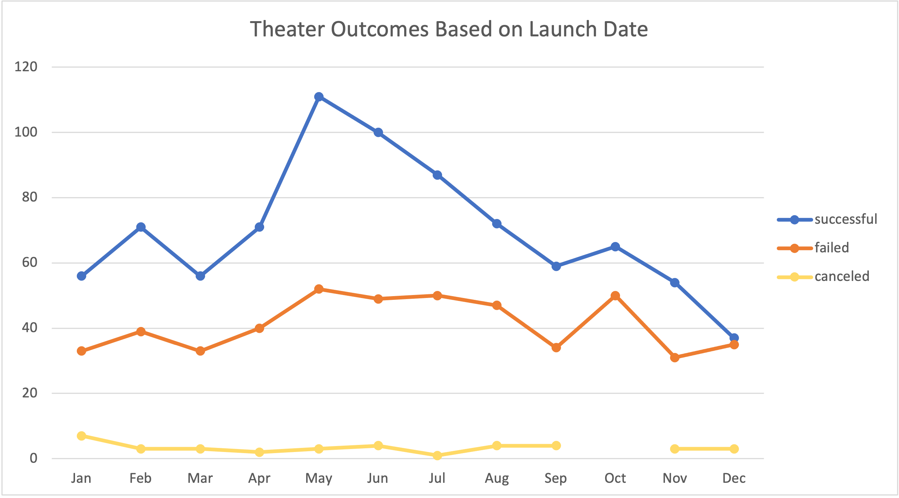
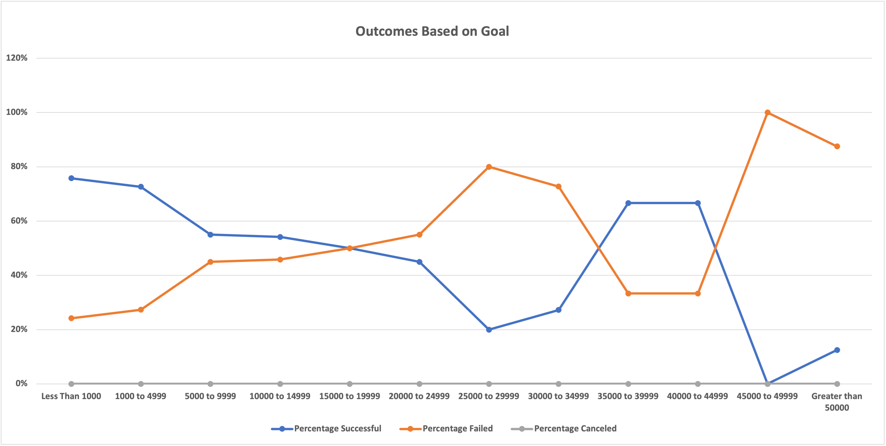

# Kickstarting with Excel

## Overview of Project

- Our friend Louis is interested in starting a crowdfunding campaign on Kickstarter. Kickstarter is one of the largest crowdfunding platform for fundraising goals. Louise is looking to fund her play "FEVER" that has an estimated budget of $10000.00 USD. 
We have been provided a Kickstarter dataset of nearly 4000 past and current running campaigns, with information on their names, goal amount, pledged amount, outcomes, country, currency, launched-date, deadline, staff pick status, spotlight status, backers_count and categories. Our project is to use Microsoft Excel to organize, sort and analyze this dataset to gain insights on factors that would make a campaign successful. Our main goal is to help Louis set her campaign by finding out what factors work the best in similar campaigns.   
- There are various components to explore from this dataset. For this report, we would focus on two factors that effects outcome, which are campaign launch dates and funding goals. 

### Purpose

- There are two main purposes of this report. First is to analyze the Kickstarter dataset to predict the success of a campaign based on campaign launch dates, specifically for those that are within the theater category. Next is to examine the relationship of funding goal amount and their outcomes.

## Analysis and Challenges
- We completed two seperate analysis for this project report. 

  1. We first created a pivot table that is named as "Theater Outcomes Based on Launch Date". The "launch dates" are seperated by each month and listed under rows, while "outcomes" are listed as columns and are counted. This way we know the number of successful, failed, and cancelled campaigns for each month. We then filtered the data to show only campaigns under theater category. Subsequently, we created a pivot chart based on this pivot table as shown below, where individual months are on the X-axis, the number of counts are on the Y-axis, with each outcomes connected and represented using lines. Successful campaigns are marked with blue lines, failed with red lines, and cancelled with yellow lines. Purpose of chart is to determine the best months and possibly the worst months to launch a project. 
  

  2. We created a new table using COUNTIFS function on Excel focusing on the "play" subcategory and the respecitve goal amount ranges. Purpose of table is to list the number of times and percentage of different outcomes in relation to the different goal amounts. From the new table, we then created a line chart "Outcomes Based on Goal" that is shown below. It lists differnt goal amounts on X-axis and a Percentage amount on the Y-axis. The blue line marks the number of successful campaigns, orange marks the number of failed campaigns, and grey line marks cancelled campaigns. For the new table there are zero campaigns that were cancelled and thus we see the grey line right on the X-axis. The purpose of this chart is to visualize how are the different outcomes are impacted by funding goal amounts.
  

- One of the biggest challenges for analyzing data at this stage is to understand the huge amount of information and pull only the useful portion to put into a meaningful graphical representation. From there we then identify any patterns that may provide a solution to an underlying question. It requires necessary skills and critical thinking. 

### Analysis of Outcomes Based on Launch Date

- Referring to chart "Theater Outcomes Based on Launch Date", it suggests that the most succesful month to launch the Kickstarter campaigns that fall under the theater category is **May**, followed by **June**. Both months have high numbers of sucessful outcomes with relatively low and constant levels of failed outcomes. 
- On the other hand, December is the month that has the lowest total outcomes and lowest succesful outcomes, and the failed numbers of outcomes almost equaled to the successful numbers.
The chart also shows that there is a spike in numbers of failed outcomes in October that roughly equaled to the same number of failed campaigns launched in May, Jun and July. 

### Analysis of Outcomes Based on Goals
- Referring to Excel sheet and Pivot line chart 'Outcomes Based on Goals" 
The chart indicates that highest failure percentage (100%) is when goal range is between $45000 to $45999. However, this may not be as indicative because there is only 1 campaign that belongs to this goal range which has the failure result. The second highest failure percentage value may be a better represnetation, where 14 out of 16 campaigns with goal amount of over $50000 have failed. This suggests that high funding goals, especially when it is over $45000 may have a high possiblility of resulting failed Kickstarter campaigns. 

- Reversely, the highest success rate or percentage (76%) is seen when goal value is set for less than $1000.00, and its rate gradually declines as goal amount increases. 
However, it is not yet to conclude that the lesser goal amount leads to higher success rates.
We found that there are twice as more sucessful campaigns than failed when goal amount is roughly between $35000 to $45000. It is difficult to determine what the true reasoning is behind the numbers though. Due to very low total project counts within the range, it is possible that there just happened to be more successful projects for the data gathered by mere chance. Or, if chance is unlikely then this may suggest that there are factors other than high goal prices that lead to unsuccessful campaigns. 

### Challenges and Difficulties Encountered
- Creating pivot charts for the above two analysis were relatively easy since the module has provided a detailed guidence on the process. The acutal challenge was identifying trends or relationships from the dataset into written analysis to deliver a solution. As previously mentioned, it involves analyitical thinking skills and hands-on practice.

## Results

### What are two conclusions you can draw about the Outcomes based on Launch Date? ###

- To summarize, the best time for Louise to launch her play "FEVER" is **May**, followed by **June**. 
At the same time, we recommend Louis to avoid launch in December and October. 

### What can you conclude about the Outcomes based on Goals? ###

- We recommend to Louis to set her funding goal target lower as the highest success rate is seen when goal value is set for less than $1000.00. However it is to keep in mind that goal target is not the only component leading to campaign success. 

### What are some limitations of this dataset? ###
- This report is based on our Kickstarter dataset containing approximately 4000 campaign samples. While the sample is large, it is difficult to determine if the sample eliminates bias and reflects the true realities. For instance, analyzation of outcomes based on parent category shows that theater category appears to be the most successful. However, our dataset contains way more projects in the theater catogery that indeed brings more successful results than others. It is unknown at this point whether the acutal Kickstarter projects fall into the categories in the same proportion as our dataset.
- To avoid sample bias we would need to query and analyze a much larger database. 

### What are some other possible tables and/or graphs that we could create? ###
- There are a few other variables that we could pull data to examine. 
     1. outcomes based on project launch period
Since we are provided the start and end date for each projects, it would be quite easy to calculate the total number of days they were launched. We may be interested to find out if there is a correlation on success rates and the length of time they ran, or whether there is a most desired duration period for a campaign.  
     2. outcomes based on Countries
Although we filtered some of the pivot tables by countries, we haven't created a table showing success rate across different coutnries. 